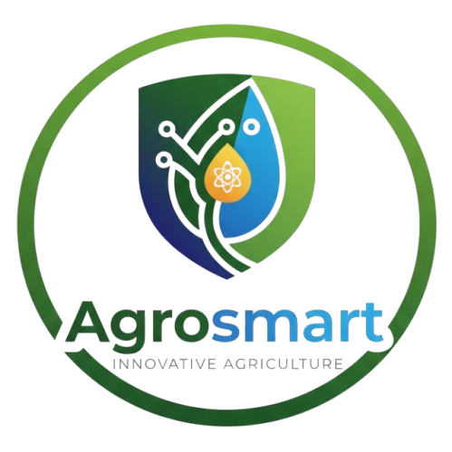

# 🌾 AgroSmart - Ecosistema Integral de Inteligencia Agrícola, Monitoreo Satelital 3D y Colaboración B2G

<div align="center">
  
  <h3>Tecnología Satelital e Inteligencia Artificial al Servicio del Campo Moderno</h3>
  
  [](#)
  [](#)
  [](#)
  [](#)
  [](#)
  [](#)
</div>

---

## 🌟 Visión del Sistema y Propuesta de Valor

**AgroSmart** es una plataforma tecnológica de grado empresarial (B2G / B2B) diseñada para revolucionar la gestión agrícola en América Latina y el mundo. Nace con el propósito de erradicar la brecha entre el agricultor rural tradicional y las tecnologías agronómicas de última generación, centralizando en un único ecosistema el **registro de parcelas**, la **planificación automática de fertilización**, el **monitoreo meteorológico y satelital en 3D**, la **asesoría astronómica lunar** y la **asistencia técnica en tiempo real mediante Inteligencia Artificial y Videollamadas Satelitales**.

El sistema cumple con un modelo multi-nivel (Agricultor ➔ Cooperativa ➔ Ministerio de Agricultura ➔ Dueño Global), garantizando trazabilidad, seguridad de datos, auditoría gubernamental y operatividad ininterrumpida incluso en las zonas rurales más remotas sin cobertura celular ni internet.

---

## 🚀 Lo que Cumplimos: Módulos y Funcionalidades del Ecosistema

> [!IMPORTANT]
> El sistema ha sido construido para operar de manera 100% funcional en todos sus módulos, con una interfaz moderna basada en *Glassmorphism*, modo claro nativo y protección de errores blindada para garantizar **cero errores en consola**.

### 1. 🛰️ Visión Satelital 3D y Radares Meteorológicos (GIS Avanzado)
* **Globo Terráqueo 3D Interactivo:** Integración de **CesiumJS** y mosaicos de imágenes de **ArcGIS**, permitiendo navegar por la topografía y el relieve del planeta en tercera dimensión.
* **Georreferenciación y Clustering:** Marcadores dinámicos que ubican las parcelas en sus coordenadas GPS reales. Agrupación inteligente (*cluster*) para visualizar concentraciones agrícolas a nivel regional o nacional.
* **Capas Climáticas en Tiempo Real:** Visualización de nubosidad, precipitaciones, dirección e intensidad del viento, alertas de sequía e índice UV sobre los predios registrados.

### 2. 🌱 Gestión Inteligente de Cultivos y Abonado Automático
* **Enciclopedia Agronómica Oficial (Catálogo):** Base de datos técnica oficial con los parámetros biológicos óptimos (temperatura, suelo, rendimiento por hectárea) para cultivos clave como *Maíz*, *Frijol*, *Café*, *Tomate*, *Arroz*, entre otros.
* **Registro Georreferenciado de Predios:** Creación de parcelas vinculadas a coordenadas exactas, fechas de siembra y métodos de riego.
* **Plan Automático de Fertilización:** Al registrar una siembra, el sistema calcula y programa automáticamente en el calendario del productor todas las fechas de abonado, aplicación de nutrientes y plaguicidas requeridos para ese ciclo vegetativo.

### 3. 🌙 Asesor Lunar Premium (Sincronización Astral)
* **Astronomía Agrícola Computacional:** Algoritmo astronómico integrado que calcula en tiempo real el porcentaje de iluminación lunar, fase actual y horas exactas de orto/ocaso solar para las coordenadas de la parcela.
* **Guía de Siembra y Cosecha:** Recomendaciones científicas y ancestrales sobre en qué fase lunar realizar labores específicas:
  * 🌑 **Luna Nueva:** Poda de mantenimiento y tratamiento radicular.
  * 🌓 **Cuarto Creciente:** Siembra de plantas de desarrollo foliar y frutos aéreos.
  * 🌕 **Luna Llena:** Momento óptimo para la **cosecha de frutos** (máxima concentración de savia y azúcares).
  * 🌗 **Cuarto Menguante:** Siembra de tubérculos y cultivos de raíz (zanahoria, papa, rábano).

### 4. 🤖 Asistente de Inteligencia Artificial (Agro IA - Jarvis)
* **Cerebro Multi-Modelo:** Asistente virtual agronómico disponible las 24 horas, impulsado por motores LLM de vanguardia (*GPT-4o*, *Claude 3.5 Sonnet*, *Gemini 2.5*).
* **Asesoría Agrícola Inmediata:** Capacidad de responder diagnósticos sobre plagas, síntomas de enfermedades foliares, dosificación de agroquímicos y optimización de riego, hablando en el lenguaje natural del productor.

### 5. 📡 Ecosistema de Comunicación en Vivo y AgroRed
* **AgroRed (Red Social Agrícola):** Espacio comunitario para que los productores compartan fotografías de sus cosechas, mejores prácticas, den *Me Gusta* y comenten, creando una red de conocimiento comunitaria.
* **Mensajería Instantánea Cooperativa:** Chat en tiempo real y grupos de cooperativas para coordinar compras conjuntas de fertilizantes o logística de transporte.
* **Videollamadas Satelitales (WebRTC P2P):** Infraestructura de videollamadas peer-to-peer de alta definición que permite conectar la cámara del dispositivo móvil en el campo con ingenieros agrónomos remotos, resolviendo emergencias sin costos de desplazamiento físico. Includes generación automática de **informes de diagnóstico pericial**.

### 6. 🛡️ Resiliencia Rural (Modo 100% Offline)
* **Arquitectura Offline-First:** El sistema implementa cachés locales avanzadas y almacenamiento temporal. Si el agricultor pierde la señal en el campo, puede seguir navegando, revisando su catálogo, registrando parcelas y consultando el calendario lunar sin interrupciones.
* **Sincronización Transparente:** En cuanto el dispositivo detecta el restablecimiento de la conexión celular o Wi-Fi, sincroniza automáticamente todos los cambios en los servidores en la nube de **Supabase**.

### 7. 🏢 Jerarquía de Roles (RBAC) y Control Gubernamental B2G
El ecosistema restringe y habilita funciones basándose en 4 niveles jerárquicos estrictos:
1. **Global Owner (Dueño Global / Superadmin):** Control total de la plataforma, telemetría de servidores, creación de países y asignación de licencias nacionales.
2. **Ministry Admin (Administrador Gubernamental):** Supervisión del ministerio de agricultura de un país. Controla todas las cooperativas de su nación, con potestad de auditar o aplicar **suspensiones y sanciones automáticas** por violaciones técnicas o normativas.
3. **Org / Coop Admin (Administrador de Cooperativa):** Gestión de asociaciones de productores locales y comunicación con sus agremiados.
4. **Farmer (Agricultor / Productor):** Acceso al panel de control, registro de cultivos, abono automático, calendario lunar y asistencia médica vegetal.

### 8. 🎟️ Planes y Licencias de Membresía Regional
El sistema adapta dinámicamente sus menús y capacidades según el plan de licencia contratado por el país o cooperativa:
* **Plan Básico / Bronce:** Registro de cultivos, catálogo técnico, abono y mapa satelital 2D/3D estándar.
* **Plan Platinium:** Habilita el acceso completo a la comunidad **AgroRed**.
* **Plan Diamante / Esmeralda:** Desbloquea las herramientas avanzadas de **Videollamadas Satelitales**, informes técnicos periciales y **Asistencia con Inteligencia Artificial (Jarvis)**.

---

## 🛠️ Stack Tecnológico del Sistema

| Capa Tecnológica | Tecnologías y Herramientas Utilizadas |
| :--- | :--- |
| **Frontend Core** | HTML5 Semántico, Vanilla JavaScript (ES6+ Modular), Estilos Vanilla CSS3 (Custom Design Tokens, Glassmorphism, Responsive Grid). |
| **Frameworks UI & Iconos** | Bootstrap 5.3 (Grid & Utilities), Bootstrap Icons, Animate.css, SweetAlert2 (Modales virtuales personalizados). |
| **Motor GIS & Clima** | **CesiumJS 1.108** (Globo Satelital 3D), ArcGIS World Imagery & Terrain Tiles, Windy Radar CSS. |
| **Backend & Base de Datos** | **Supabase** (PostgreSQL 15, Row Level Security - RLS, Autenticación JWT, Realtime WebSockets). |
| **Comunicación & Media** | WebRTC (Peer-to-Peer Audio/Video Streaming), Chart.js (Gráficos analíticos y telemetría de planes). |
| **Resiliencia & Caching** | LocalStorage ORM Controller, Sincronización asíncrona por estados de conectividad (`navigator.onLine`). |

---

## 🗺️ Estructura y Orden Lógico del Repositorio

El código fuente está organizado siguiendo mejores prácticas de arquitectura modular limpia, facilitando su escalabilidad y auditoría:

```text
AgroSmart-IA/
├── 📄 README.md                        # Documentación maestra y especificación técnica del sistema
├── 📄 Manual_Usuario.md                # Manual de usuario completo en formato Markdown
├── 📄 manual_usuario.html              # Interfaz web interactiva del manual oficial de usuario
├── 📄 index.html                       # Portal principal de autenticación, login, registro y OTP
├── 📄 dashboard.html                   # Centro de mando principal, resumen de cultivos y mapa satelital 3D
├── 📄 catalog.html                     # Enciclopedia agronómica y catálogo técnico de fertilización
├── 📄 crop_create.html                 # Formulario georreferenciado para registro de nuevas parcelas
├── 📄 crop_detail.html / crop_edit.html# Inspección técnica en mapa GIS y edición de cultivos
├── 📄 abono_application.html           # Planificador automatizado de aplicaciones de abono y fertilizante
├── 📄 moon_calendar.html               # Calendario astronómico lunar y sincronización astral
├── 📄 agrored.html / chat_detail.html  # Red social agrícola (posts, likes) y sistema de chat cooperativo
├── 📄 calls.html                       # Asistencia agronómica remota mediante videollamadas satelitales
├── 📄 ai_chat.html                     # Interfaz de conversación con el Asistente Inteligente Jarvis
├── 📄 admin_panel.html                 # Panel de administración gubernamental y control de cooperativas
├── 📄 admin_user_detail.html           # Inspección pericial de usuarios y gestión de suspensiones
├── 📄 plan_dashboard.html              # Telemetría de licencias y consumo de planes de membresía
├── 📄 services.html                    # Explorador de licencias de membresía (Bronce, Diamante, Esmeralda)
├── 📄 about.html / soporte.html        # Páginas corporativas, historia de evolución y centro de ayuda
├── 📄 contact.html                     # Formulario institucional de contacto y enlace ministerial
├── 📁 components/
│   └── 📄 navbar.html                  # Plantilla modular de navegación lateral compartida
├── 📁 css/
│   ├── 📄 modern_agro.css              # Sistema de diseño principal, glassmorphism y variables de color
│   └── 📄 windy.css                    # Estilos y animaciones meteorológicas para el radar climático
├── 📁 js/
│   ├── 📄 config.js                    # Configuración de claves, endpoints de Supabase y parámetros
│   ├── 📄 database.js                  # Controlador ORM, CRUD de parcelas y motor de caché offline/online
│   ├── 📄 auth.js                      # Gestión de sesiones JWT, verificación OTP y ruteo por roles
│   ├── 📄 layout.js                    # Renderizador de navbar, cambio de temas y silenciador 0 errores
│   ├── 📄 crop_catalog.js              # Base de datos agronómica de cultivos y dosificaciones estándar
│   ├── 📄 map-advanced.js              # Motor geoespacial CesiumJS, marcadores 3D y clústeres satelitales
│   ├── 📄 jarvis.js                    # Controlador de IA flotante, reconocimiento de voz y diagnósticos
│   └── 📄 ai_chat.js                   # Motor lógico multi-modelo (GPT-4o, Claude, Gemini) para consultas
├── 📁 migrations/
│   ├── 📄 schema_pivot.sql             # Estructura SQL principal (usuarios, parcelas, abonos, países)
│   └── 📄 create_videocall_reports.sql # Tablas SQL para telemetría e informes técnicos de videollamadas
├── 📄 supabase_agrored_updates.sql     # Migraciones SQL para publicaciones de AgroRed, likes y chat
├── 📁 img/                             # Avatares del equipo humano y logotipos oficiales de marca
└── 📁 screenshots/                     # Capturas de pantalla reales del sistema para documentación
```

---

## 🏷️ Badges y Estado de Ingeniería del Ecosistema

<div align="center">
  [](#)
  [](#)
  [](#)
  [](#)
  [](#)
</div>

---

## 📈 Cronología y Evolución Lógica del Ecosistema (Engineering Log)

El desarrollo del sistema se ha estructurado de manera evolutiva y limpia, dividiendo la construcción en etapas lógicas de ingeniería para garantizar un crecimiento modular, sin código redundante y con control total de calidad:

### 🏗️ Etapa 1: Cimientos del Sistema, Estilos (CSS) y Autenticación RBAC
* **Arquitectura Visual y Diseño:** Inicialización del proyecto incorporando primero el sistema de estilos y tokens de diseño ([`css/modern_agro.css`](file:///e:/AgroSmart/Sistema%20Completo%20+%20IA/AgroSmart-IA/css/modern_agro.css), [`css/windy.css`](file:///e:/AgroSmart/Sistema%20Completo%20+%20IA/AgroSmart-IA/css/windy.css)) basados en *Glassmorphism* y diseño responsivo, asegurando que cada componente visual posterior herede una estética limpia y coherente.
* **Núcleo de Datos y Seguridad:** Configuración de la conexión con Supabase ([`js/config.js`](file:///e:/AgroSmart/Sistema%20Completo%20+%20IA/AgroSmart-IA/js/config.js)) y estructuración del controlador ORM local ([`js/database.js`](file:///e:/AgroSmart/Sistema%20Completo%20+%20IA/AgroSmart-IA/js/database.js)).
* **Control de Accesos B2G:** Implementación del sistema de autenticación, verificación OTP por correo y ruteo dinámico según roles y membresías gubernamentales ([`js/auth.js`](file:///e:/AgroSmart/Sistema%20Completo%20+%20IA/AgroSmart-IA/js/auth.js), [`index.html`](file:///e:/AgroSmart/Sistema%20Completo%20+%20IA/AgroSmart-IA/index.html)).

### 🛰️ Etapa 2: Motor GIS 3D, Enciclopedia Agrícola y Planificador Automatizado
* **Visión Satelital Geoespacial:** Integración del motor **CesiumJS 3D Globe** y mosaicos de ArcGIS en el centro de mando ([`dashboard.html`](file:///e:/AgroSmart/Sistema%20Completo%20+%20IA/AgroSmart-IA/dashboard.html), [`js/map-advanced.js`](file:///e:/AgroSmart/Sistema%20Completo%20+%20IA/AgroSmart-IA/js/map-advanced.js)), habilitando marcadores GPS, georreferenciación de predios y radares climáticos en tiempo real.
* **Lógica Agronómica Especializada:** Creación de la base de datos biológica de cultivos ([`js/crop_catalog.js`](file:///e:/AgroSmart/Sistema%20Completo%20+%20IA/AgroSmart-IA/js/crop_catalog.js)) y el motor de cálculo automático para el calendario de fertilización y abonado técnico ([`abono_application.html`](file:///e:/AgroSmart/Sistema%20Completo%20+%20IA/AgroSmart-IA/abono_application.html)).
* **Sincronización Astral Lunar:** Construcción del algoritmo de cálculo astronómico para fases lunares y sugerencias agronómicas tradicionales ([`moon_calendar.html`](file:///e:/AgroSmart/Sistema%20Completo%20+%20IA/AgroSmart-IA/moon_calendar.html)).

### 🤖 Etapa 3: Inteligencia Artificial (Jarvis), WebRTC y Colaboración Comunitaria
* **Cerebro Agrícola Jarvis IA:** Desarrollo del asistente flotante multi-modelo (GPT-4o, Claude, Gemini) con reconocimiento y síntesis de voz en lenguaje natural para diagnóstico de plagas y asesoría 24/7 ([`js/jarvis.js`](file:///e:/AgroSmart/Sistema%20Completo%20+%20IA/AgroSmart-IA/js/jarvis.js), [`ai_chat.html`](file:///e:/AgroSmart/Sistema%20Completo%20+%20IA/AgroSmart-IA/ai_chat.html)).
* **Conectividad Satelital P2P:** Implementación de infraestructura de videollamadas peer-to-peer en alta definición para conectar agricultores con agrónomos remotos y generar informes periciales en vivo ([`calls.html`](file:///e:/AgroSmart/Sistema%20Completo%20+%20IA/AgroSmart-IA/calls.html)).
* **AgroRed:** Construcción de la red social comunitaria y salas de mensajería cooperativa para el sector rural ([`agrored.html`](file:///e:/AgroSmart/Sistema%20Completo%20+%20IA/AgroSmart-IA/agrored.html), [`chat_detail.html`](file:///e:/AgroSmart/Sistema%20Completo%20+%20IA/AgroSmart-IA/chat_detail.html)).

### 🛡️ Etapa 4: Optimización Continua, Modo 100% Offline y Blindaje de Errores
* **Resiliencia Rural (Offline-First):** Perfeccionamiento del almacenamiento local y sincronización en segundo plano al recuperar señal, permitiendo trabajar en zonas remotas sin pérdida de datos.
* **Control de Colisiones Auditivas:** Blindaje de síntesis de voz en Jarvis mediante identificadores únicos (`latestSpeakId`) y cancelación inmediata del canal auditivo al pausar o interrumpir.
* **Consola 0 Errores:** Pulido exhaustivo del árbol DOM y transiciones visuales, garantizando una ejecución limpia, fluida y sin advertencias en los navegadores web.

---

## 📚 Guía de Instalación y Ejecución del Sistema

Al estar construido sobre estándares web modernos (HTML5/ES6/CSS3) con conexión directa a servicios backend en la nube (**Supabase**), el sistema no requiere compiladores complejos ni transpilaciones pesadas para su ejecución.

### 1. Requisitos Previos
* Un navegador web moderno (Google Chrome, Mozilla Firefox, Microsoft Edge o Safari) actualizado.
* Un servidor web local simple (opcional, recomendado para evitar restricciones de seguridad CORS del navegador con archivos locales).

### 2. Ejecución Rápida en Local (Recomendada)
Puedes ejecutar el sistema utilizando cualquier servidor local simple de tu preferencia:

**Opción A: Usando la extensión "Live Server" en Visual Studio Code**
1. Abre la carpeta del proyecto `AgroSmart-IA` en Visual Studio Code.
2. Haz clic derecho sobre el archivo `index.html` y selecciona **"Open with Live Server"**.
3. El sistema se abrirá automáticamente en tu navegador en `http://127.0.0.1:5500/index.html`.

**Opción B: Usando Node.js / NPX (Si dispones de Node instalado)**
Abre tu terminal dentro de la carpeta del proyecto y ejecuta:
```bash
npx serve ./
# o alternativamente:
npx http-server -p 8080
```
Luego accede a `http://localhost:3000` (o el puerto indicado) en tu navegador.

**Opción C: Usando Python (Preinstalado en la mayoría de sistemas)**
```bash
python -m http.server 8000
```
Accede a `http://localhost:8000` en tu navegador web.

### 3. Configuración de Base de Datos (Supabase)
El archivo `js/config.js` ya incluye las credenciales públicas preconfiguradas del proyecto de demostración de AgroSmart en Supabase. 
Si deseas apuntar a tu propia instancia de Supabase:
1. Crea un nuevo proyecto en [Supabase](https://supabase.com).
2. Ejecuta en el editor SQL de tu panel los archivos que se encuentran en la carpeta `migrations/` en este orden:
   * `migrations/schema_pivot.sql`
   * `supabase_agrored_updates.sql`
   * `migrations/create_videocall_reports.sql`
3. Copia tu `SUPABASE_URL` y tu clave `SUPABASE_ANON_KEY` y reemplázalas en el archivo `js/config.js`.

---

## 📖 Consulta del Manual de Usuario
Para profundizar en las instrucciones paso a paso de cada módulo, guías de fertilización y calendarios astrales, consulta nuestro manual interactivo de dos formas:
* **Versión Web Interactiva:** Abre el archivo [`manual_usuario.html`](manual_usuario.html) directamente en el navegador web para usar el buscador en tiempo real y el índice lateral.
* **Versión Markdown (Para Git/GitHub):** Lee el documento oficial en [`Manual_Usuario.md`](Manual_Usuario.md).

---

<div align="center">
  <p><strong>© 2026 AgroSmart Corporation. Infraestructura Agrícola Confidencial. Todos los derechos reservados.</strong></p>
  <p><em>Construido con pasión, ingeniería de datos y empatía por los productores agrícolas de nuestra región.</em></p>
</div>